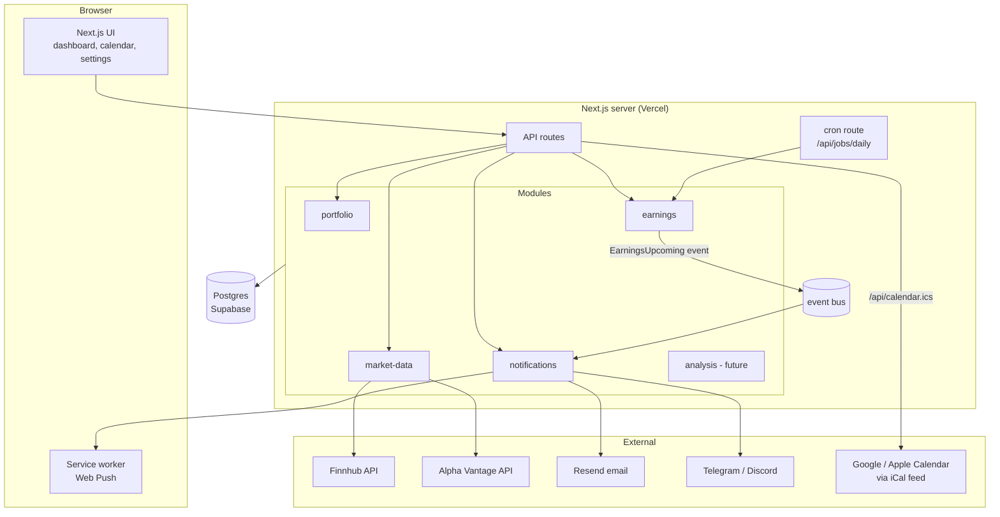
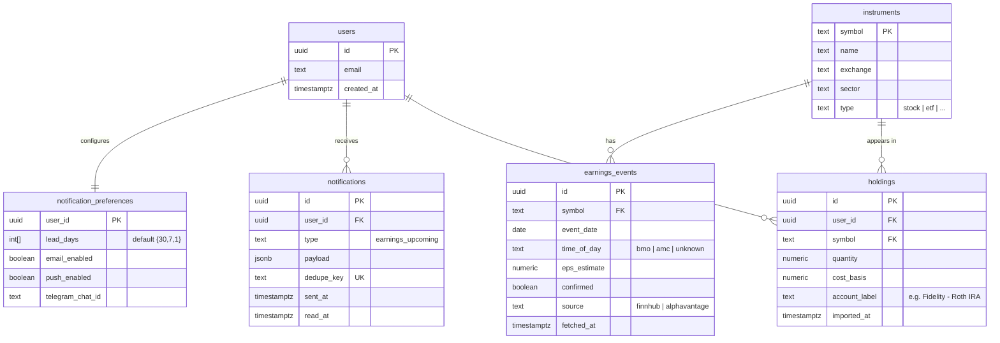
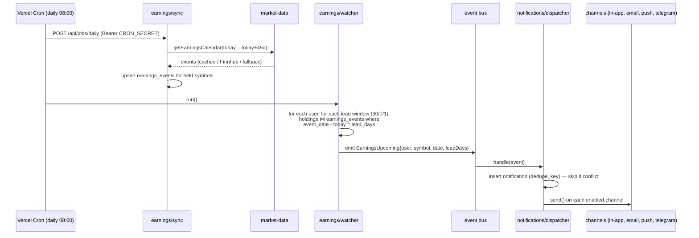

# Portlander — Architecture

> A modular website that pulls realtime market data from free APIs, tracks your
> holdings, and notifies you when a holding's earnings date is coming up —
> starting with a 30-day heads-up.

This document is the complete blueprint: the stack, the module layout, the data
model, the earnings-alert pipeline, how notifications work, how to get your
holdings out of Fidelity, and a roadmap of future features with a home already
carved out for each one.

---

## 1. Product vision

Portlander is a **calendar for your portfolio**. Everything that will happen to
your money on a date — earnings, dividends, ex-dividend dates, splits — lands on
one calendar, and the site warns you before it happens.

**v1 (the killer feature):** import your holdings, and get notified whenever a
holding's earnings date is within 30 days (with follow-up reminders at 7 days
and 1 day).

Everything else in this document exists to make v1 shippable fast *and* make v2,
v3, v10 cheap to add.

---

## 2. Guiding principles

1. **Modular monolith, not microservices.** One deployable app, but internally
   split into feature modules with strict boundaries. You get microservice-style
   modularity without the operational pain. If one module ever needs to scale
   independently, its clean interface makes extraction easy.
2. **Every external thing is behind an adapter.** Market data providers,
   notification channels, and broker imports all sit behind small interfaces.
   Swapping Finnhub for Alpha Vantage, or adding Telegram alerts, never touches
   business logic.
3. **The server owns all data fetching.** The browser never calls a market data
   API directly. This keeps API keys secret, lets every user share one cache,
   and keeps you inside free-tier rate limits.
4. **Free tier everywhere.** Every component below has a $0 tier that
   comfortably fits a personal portfolio tracker.

---

## 3. Recommended stack

| Layer | Choice | Why |
|---|---|---|
| Framework | **Next.js 15 (App Router) + TypeScript** | UI + API routes + server jobs in one codebase and one deploy; huge ecosystem |
| Database | **Postgres on Supabase** (free tier) | Real SQL, generous free tier, built-in auth if you ever go multi-user; SQLite via the same ORM for local dev |
| ORM | **Drizzle** | Type-safe schema in TypeScript, painless migrations |
| Hosting | **Vercel** (hobby tier) | Zero-config Next.js deploys, HTTPS out of the box (needed for Web Push) |
| Scheduler | **Vercel Cron** hitting an internal API route | Free daily/hourly triggers; no server to babysit |
| Market data | **Finnhub** (primary), **Alpha Vantage** (fallback) | Both free; details in §5 |
| Email | **Resend** (free: 100 emails/day) | Trivial API, more than enough for alerts |
| Charts (later) | TradingView **lightweight-charts** | Free, canonical-looking financial charts |

You could substitute any piece (e.g. self-host on a $5 VPS with real cron), and
because of the adapter rule, nothing else would change.

---

## 4. System overview



---

## 5. Directory layout (the modular skeleton)

```
portlander/
├── src/
│   ├── core/                      # shared infrastructure, no business logic
│   │   ├── db/                    #   drizzle client + schema + migrations
│   │   ├── config.ts              #   env parsing (zod-validated)
│   │   ├── events.ts              #   tiny typed event bus
│   │   └── rate-limiter.ts        #   token-bucket per provider
│   │
│   ├── modules/
│   │   ├── portfolio/
│   │   │   ├── service.ts         # holdings CRUD
│   │   │   ├── import/
│   │   │   │   ├── importer.ts    # BrokerImporter interface
│   │   │   │   └── fidelity-csv.ts
│   │   │   └── types.ts
│   │   │
│   │   ├── market-data/
│   │   │   ├── provider.ts        # MarketDataProvider interface
│   │   │   ├── providers/
│   │   │   │   ├── finnhub.ts
│   │   │   │   ├── alpha-vantage.ts
│   │   │   │   └── yahoo.ts       # optional, unofficial
│   │   │   ├── registry.ts        # priority + fallback + rate limits
│   │   │   ├── cache.ts           # DB-backed cache with TTLs
│   │   │   └── service.ts         # what other modules actually call
│   │   │
│   │   ├── earnings/
│   │   │   ├── sync.ts            # refresh earnings dates for held symbols
│   │   │   ├── watcher.ts         # find events inside alert windows
│   │   │   └── types.ts
│   │   │
│   │   ├── notifications/
│   │   │   ├── channel.ts         # NotificationChannel interface
│   │   │   ├── channels/
│   │   │   │   ├── in-app.ts
│   │   │   │   ├── email.ts
│   │   │   │   ├── web-push.ts
│   │   │   │   └── telegram.ts
│   │   │   ├── dispatcher.ts      # dedupe + fan-out to enabled channels
│   │   │   └── preferences.ts
│   │   │
│   │   └── analysis/              # future: P/L, allocation, indicators
│   │
│   └── app/                       # Next.js routes — THIN, call modules only
│       ├── (dashboard)/           # pages: holdings, calendar, settings
│       └── api/
│           ├── holdings/route.ts
│           ├── import/route.ts
│           ├── calendar.ics/route.ts
│           └── jobs/daily/route.ts   # hit by Vercel Cron (secret-protected)
├── drizzle/                       # generated migrations
└── vercel.json                    # cron schedule lives here
```

**The rules that keep it modular:**

- `app/` (routes/UI) may import from `modules/*/service.ts` — never the reverse.
- Modules may import from `core/` — never from each other's internals. Cross-
  module communication goes through public service functions or the event bus.
- Adding a feature = adding a module. Adding a data source or notification
  channel = adding one adapter file.

---

## 6. Market data layer (the heart)

### 6.1 The provider interface

```ts
// src/modules/market-data/provider.ts
export interface MarketDataProvider {
  readonly name: string;
  readonly rateLimit: { requests: number; perSeconds: number };

  getQuote(symbol: string): Promise<Quote>;
  getEarningsCalendar(params: {
    symbol?: string;
    from: string; // YYYY-MM-DD
    to: string;
  }): Promise<EarningsEvent[]>;
  getCompanyProfile(symbol: string): Promise<CompanyProfile>;
}
```

### 6.2 Free providers, compared

| Provider | Free limits | Earnings calendar? | Realtime quotes? | Notes |
|---|---|---|---|---|
| **Finnhub** | 60 calls/min | ✅ `/calendar/earnings` (date-range query — one call covers your whole portfolio) | ✅ (US stocks) | Best free option; make it primary |
| **Alpha Vantage** | 25 calls/day | ✅ `EARNINGS_CALENDAR` (bulk CSV, 3-month horizon in one call) | 15-min delayed | Tiny quota, but the bulk earnings CSV is perfect as a daily fallback |
| **Financial Modeling Prep** | 250 calls/day | ✅ | ✅ | Good third option |
| yahoo-finance2 (npm) | Unofficial, no key | ✅-ish | ✅ | No ToS guarantee — treat as bonus fallback, never the backbone |

Verify current limits when you sign up — free tiers shift — but the architecture
doesn't care: that's the point of the registry.

### 6.3 Registry: priority, fallback, rate limiting, caching

```ts
// pseudocode for market-data/service.ts
async function getEarningsCalendar(range) {
  const cached = await cache.get(key(range));           // DB cache table
  if (cached && !expired(cached)) return cached.data;

  for (const provider of registry.byPriority()) {       // finnhub → AV → yahoo
    if (!rateLimiter.allow(provider)) continue;         // token bucket
    try {
      const data = await provider.getEarningsCalendar(range);
      await cache.set(key(range), data, TTL.EARNINGS);  // 24 h
      return data;
    } catch (e) { log.warn(e); }                        // fall through
  }
  if (cached) return cached.data;                       // stale > nothing
  throw new NoProviderAvailableError();
}
```

**Cache TTLs:** quotes ≈ 60 s (that's "realtime enough" for a tracker and turns
1,000 page loads into ~1 API call/min), earnings dates ≈ 24 h, company profiles
≈ 30 days. The cache is a Postgres table (`cache_entries(key, payload, expires_at)`)
— no Redis needed at this scale; add Upstash Redis later if you want.

---

## 7. Data model



Notes:

- **`instruments` is separate from `holdings`** so ten users holding AAPL share
  one earnings sync, and so watchlists (future) can reference instruments
  without owning them.
- **`dedupe_key`** (unique index) is the idempotency backbone:
  `"{user_id}:{symbol}:{event_date}:{lead_days}"`. The daily job can run twice,
  crash halfway, or be replayed — you still get exactly one "AAPL reports in 30
  days" alert.
- ETFs and mutual funds from your Fidelity export simply have no earnings
  events; they still show up in holdings and future analytics.

---

## 8. The earnings watcher (v1 feature, end to end)



Implementation details worth getting right:

1. **One cron, two phases.** Sync first (write fresh `earnings_events`), then
   watch (read them). Keeping the watcher a pure DB query makes it trivially
   testable — seed rows, assert events.
2. **Sync a 45-day horizon** even though the alert is 30 days — earnings dates
   get announced, moved, and confirmed; the buffer means a date sliding around
   still gets caught.
3. **Fetch by date-range, not per-symbol.** Finnhub's earnings calendar returns
   *all* companies for a range in one call; filter to your held symbols in
   code. Your API usage stays flat no matter how many holdings you have.
4. **Protect the job route.** `/api/jobs/daily` checks
   `Authorization: Bearer ${CRON_SECRET}` so only Vercel Cron (configured in
   `vercel.json`) can trigger it.
5. **Dates, not datetimes, for comparison.** Compare calendar dates in the
   exchange's timezone (US markets → `America/New_York`) to avoid the classic
   off-by-one at UTC midnight.

---

## 9. Notifications — deep dive

### 9.1 The channel interface

```ts
// src/modules/notifications/channel.ts
export interface NotificationChannel {
  readonly name: string;
  isEnabledFor(prefs: NotificationPreferences): boolean;
  send(user: User, n: NotificationPayload): Promise<void>;
}
```

The dispatcher inserts the notification row (dedupe), then loops over
registered channels. Adding a channel is one ~50-line file, zero changes
elsewhere.

### 9.2 Channels, ranked by effort vs. payoff

| Channel | Cost | Effort | Reaches you when site is closed? | Verdict |
|---|---|---|---|---|
| **In-app center** (bell icon reading `notifications` table) | $0 | Trivial | ❌ | Build first — it's just the DB rows you already wrote, and it's the audit log for every other channel |
| **iCal feed** (`/api/calendar.ics`) | $0 | Low | ✅ via your phone's native calendar | **Sleeper hit.** Serve your earnings events as an iCalendar feed with `VALARM` reminders; subscribe once in Google/Apple Calendar and your phone nags you natively. Zero infra, works forever, and it *is* "a calendar for my portfolio". Protect the URL with a random token (`/api/calendar.ics?token=...`) |
| **Email** (Resend) | $0 (100/day) | Low | ✅ | The workhorse. Do this in v1 |
| **Telegram bot** | $0 | Low | ✅ instant phone push | Create a bot with @BotFather, store your `chat_id`, `POST sendMessage`. Easiest true push notification that exists |
| **Web Push** (service worker + VAPID) | $0 | Medium | ✅ (browser-dependent; iOS needs the site installed to home screen) | Great native feel, but do it after email/Telegram — most fiddly of the free options |
| SMS (Twilio) | 💰 | Low | ✅ | Skip unless you really want texts |

**v1 recommendation:** in-app + email + iCal feed. Add Telegram the first time
an email alert feels too slow, and Web Push when you feel like polish.

### 9.3 Delivery semantics

- **At-least-once attempt, exactly-once record.** The `dedupe_key` insert
  gates everything; a channel failure marks the row for retry on the next cron
  run rather than duplicating.
- **Digest over spam.** If 6 holdings enter the 30-day window on the same day,
  send *one* email listing all six, not six emails. (Group events per user per
  run before dispatching.)
- **Preferences from day one.** `lead_days int[]` (default `{30,7,1}`) plus
  per-channel toggles — it's one small table and saves a migration later.

---

## 10. Getting your holdings out of Fidelity

**Short answer: yes, freely.** Your positions are your own data, and ticker
symbols are public identifiers — there is nothing proprietary about "I own 12
shares of MSFT." What Fidelity does *not* offer is a public API, so the options
are:

### Option A — CSV export/import (build this) ✅
1. Fidelity → **Accounts & Trade → Portfolio → Positions → Download** (CSV).
2. Portlander's import page accepts the file, parses it (Fidelity's export has
   header/footer junk rows and columns like `Symbol`, `Quantity`,
   `Cost Basis Total`, `Account Name` — strip and map), previews the parsed
   holdings, and upserts on confirm.
3. The parser lives behind a `BrokerImporter` interface
   (`fidelity-csv.ts` implements it), so a Schwab or Robinhood CSV later is
   just another adapter. Handle Fidelity quirks: money-market/cash rows
   (`SPAXX**`), option symbols, `n/a` cost basis on some lots.

Effort: an afternoon. Reliability: total. Legality/ToS: it's an export button
Fidelity gives you — completely fine. Re-import whenever your positions change
(the importer diffs and updates rather than duplicating).

### Option B — Aggregator API (automatic sync, later)
**SnapTrade** or **Plaid Investments** connect to Fidelity via a secure OAuth
flow and return positions programmatically. This is how Mint-style apps work.
Trade-offs: developer-tier limits/pricing, a third party in your data path, and
more moving parts. Nice v3 feature; unnecessary for one person's portfolio.

### Option C — Screen-scraping with your stored credentials ❌
Don't. It violates Fidelity's terms, breaks every time they change their HTML,
and storing brokerage credentials in your own web app is the single riskiest
thing you could do in this project. Options A and B exist precisely so you
never do this.

> Privacy note: since v1 is your real financial data, keep the deployment
> private — auth from day one (even just Supabase magic-link for a single
> allowed email), secrets in env vars, and never commit the CSV.

---

## 11. Feature roadmap (brainstorm, mapped to modules)

Because each of these lands in an existing module or a new sibling module, none
of them require rearchitecting:

| Phase | Feature | Where it lives |
|---|---|---|
| **v1** | Holdings CRUD + Fidelity CSV import | `portfolio` |
| **v1** | Earnings within 30/7/1 days → notify | `earnings` + `notifications` |
| **v1** | In-app center, email, iCal feed | `notifications` |
| **v1.5** | **Calendar month view** — every portfolio event on a grid (this is the README's soul) | new page over `earnings` data |
| **v1.5** | Live quote strip / holding prices on dashboard | `market-data` |
| **v2** | **Dividend & ex-dividend alerts** (own the date, get the dividend) | `dividends` module, reuses the whole watcher/dispatcher pipeline |
| **v2** | **Price alerts** — threshold crossed, ±X% daily move | `alerts` module + a more frequent cron |
| **v2** | **Post-earnings digest** — next morning: beat/miss vs. estimate, price reaction | `earnings` + `notifications` |
| **v2** | Telegram + Web Push channels | `notifications/channels/` |
| **v3** | Portfolio analytics — sector/asset allocation, P/L vs. cost basis, concentration warnings | `analysis` |
| **v3** | Per-holding news feed (Finnhub `/company-news`) | `news` module |
| **v3** | Watchlists (track without owning) | `portfolio` (instrument refs without quantity) |
| **v3** | Automatic broker sync (SnapTrade) | `portfolio/import/` — just another `BrokerImporter` |
| **v4** | AI earnings-call summaries & "what to watch" briefs before each earnings date | `insights` module (transcript API + LLM) |
| **v4** | Charts (TradingView lightweight-charts) with your cost basis overlaid | `analysis` UI |

---

## 12. Scaling path (when, not if)

1. **Now (1 user):** everything above. Postgres cache, cron once daily,
   quotas laughably comfortable.
2. **Dozens of users:** add Supabase Auth (already in the stack), turn the
   quote cache TTL down, maybe add hourly earnings sync. Still one deploy.
3. **Notification volume hurts:** move dispatching behind a queue
   (Upstash QStash — free tier, HTTP-based, Vercel-friendly). The dispatcher
   already has the right shape; only its invocation changes.
4. **A module outgrows the monolith** (e.g. `market-data` needs websockets for
   true realtime): extract it behind its existing interface into its own
   service. The interface was the contract all along.

## 13. Environment & secrets checklist

```
DATABASE_URL=            # Supabase Postgres
FINNHUB_API_KEY=
ALPHAVANTAGE_API_KEY=
RESEND_API_KEY=
CRON_SECRET=             # random string; Vercel Cron sends it as Bearer token
CALENDAR_FEED_TOKEN=     # random string for the private .ics URL
NEXT_PUBLIC_APP_URL=
# later: VAPID_PUBLIC_KEY / VAPID_PRIVATE_KEY (web push), TELEGRAM_BOT_TOKEN
```

## 14. Build order (first two weeks of evenings)

1. Scaffold Next.js + Drizzle + Supabase; migrate the §7 schema.
2. `portfolio` module + Fidelity CSV importer + holdings page.
3. `market-data` module: Finnhub adapter, cache table, registry (fallback can
   be a stub returning "unavailable" at first).
4. `earnings` sync + watcher, `/api/jobs/daily`, `vercel.json` cron.
5. `notifications`: table + in-app center + Resend email channel.
6. iCal feed route. Subscribe on your phone. Enjoy the first native reminder.
7. Deploy to Vercel, add auth, import your real CSV.
